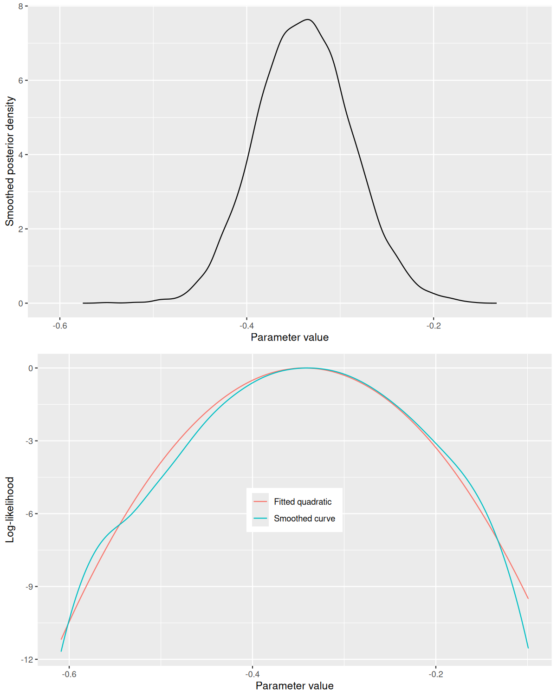
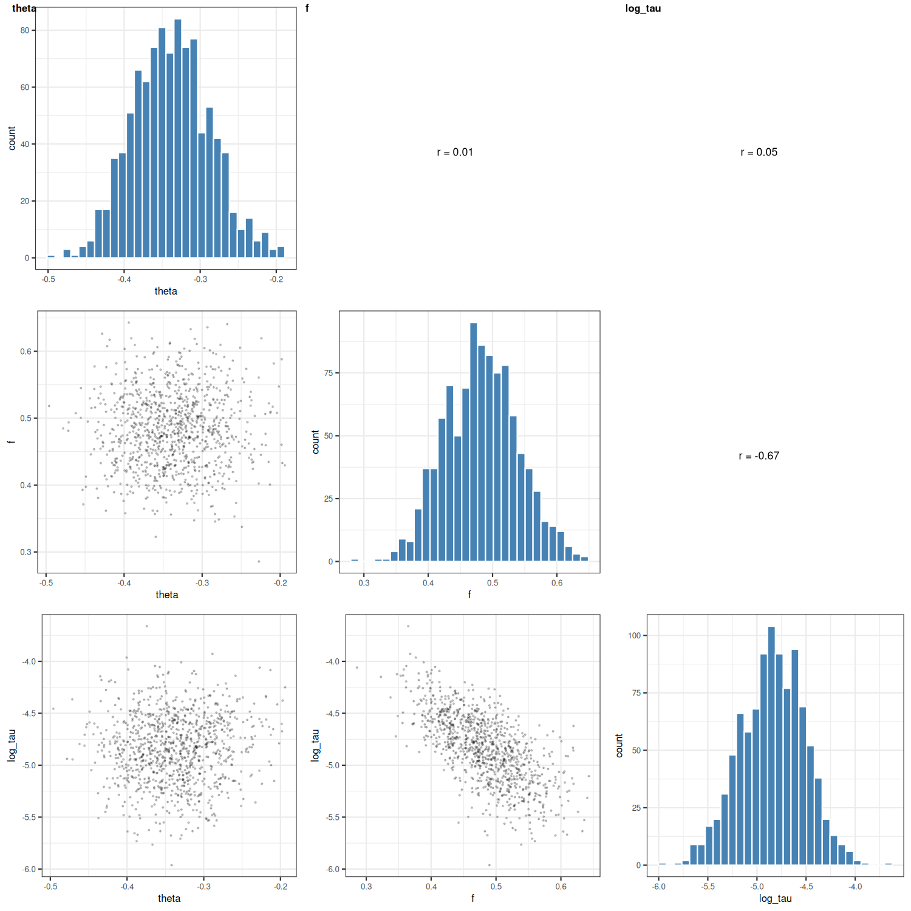
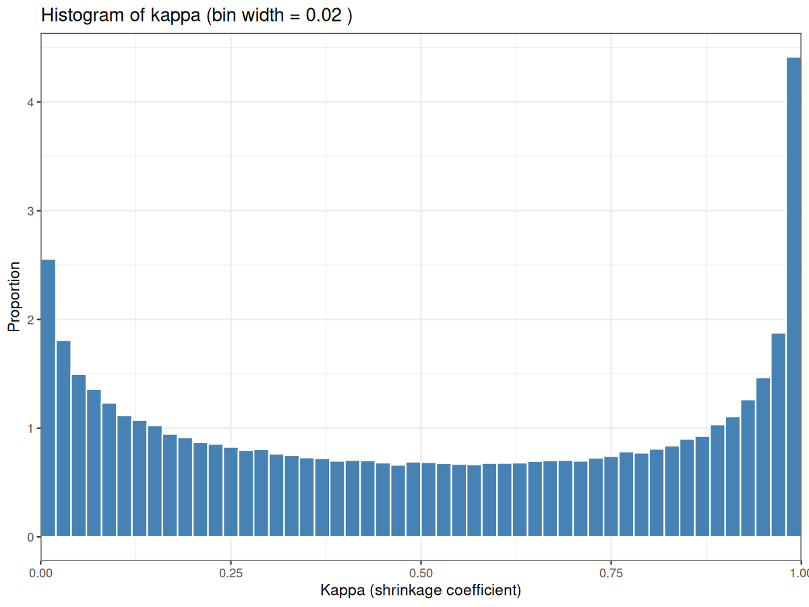

# MR-Hevo -- Inference of causal effects by Mendelian randomization, marginalizing over distribution of pleiotropic effects

Mendelian randomization has been widely used to study causal effects of exposures (broadly defined to include behavioural traits, biomarkers and gene expression levels) on diseases.  The biggest methodological challenge is how to infer causality when some of the genetic instruments have direct (pleiotropic) effects on the outcome that are not mediated through the exposure under study.  These pleiotropic effects are not directly observed, and their distribution over the instruments is unknown.

Inference of causal effects can be tackled like any other statistical problem, by computing the likelihood (or posterior distribution) of the parameter of interest (the causal effect) while marginalizing over the distribution of nuisance variables (in this case the pleiotropic effects).  If we can compute the posterior distribution of the parameter of interest, we can obtain the likelihood by dividing by the prior on that parameter.

As the form of the distribution of pleiotropic effects over loci is unknown, any realistic statistical model has to specify a prior that encompassses a broad family of symmetric distributions ranging from a spike-and-slab to a Gaussian.  An initial implementation of this approach has been been described by [Berzuini et al (2020)](https://doi.org/10.1093/biostatistics/kxy027).  They specify a horseshoe prior for the pleiotropic effects, and generate the posterior distribution of all model parameters, including the causal effect parameter, by Markov chain Monte Carlo sampling.  An implementation that uses only summary statistics has been described by [Grant and Burgess (2023)](https://doi.org/10.1016/j.ajhg.2023.12.002) as "MR-HORSE.  The methods used in this package differ from MR-HORSE in that: 

1. The model specifies a regularized horseshoe prior on shrinkage coefficients, as described by [Piironen and Vehtari (2017)](https://doi.org/10.1214/17-EJS1337SI).  This prior, known as the "Finnish horseshoe", has better computational properties than the original horseshoe.  On this basis, the method is named `MR-Hevo` (hevo is Finnish for a horse).

2. The package uses the NUTS (No U-Turn Sampler) algorithm to sample the posterior.  This is implemented using `Stan` (by default) or `NumPyro`.  

3. The marginal likelihood of the causal effect parameter is computed from the posterior and the prior, yielding classical maximum likelihood estimates and _p_-values for the causal effect.

The motivation for this work was to develop a method to test formally for causality in [genome-wide aggregated _trans_- effects analysis](https://doi.org/10.1016/j.ajhg.2023.04.003), which aims to detect core genes for a disease or trait by testing for association with predicted _trans_- effects of SNPs on gene expression, aggregated over multiple QTLs.  With this approach, the genetic instruments are scalar variables calculated from clumps of SNPs that have _trans_- effects on the expression of a gene as transcript or circulating protein.  There is no need to exclude weak instruments because they are correctly handled by Bayesian inference.

## Guide

- A description of the statistical model is available on the [theory page](https://github.com/molepi-precmed/mrhevo/blob/main/theorymethods.pdf)

## Installation

To install current development version of the package from GitHub use:

1. For the production version:

```r
library(devtools)
devtools::install_github(repo="molepi-precmed/mrhevo", ref="package")
```

2. For the development version (recommended if facing Stan compilation issues):

```r
library(devtools)
devtools::install_github(repo="molepi-precmed/mrhevo", ref="main")
```

If you want to run the examples: 

```r
## get the source code
devtools::install_github("molepi-precmed/mrhevo", ref="main", build=FALSE)
setwd("path/to/local/clone/of/mrhevo")

## load the package
devtools::load_all()

## run the examples
devtools::run_examples()
```

## Example: Using summary statistics

This example demonstrates how to run MR-Hevo using summary statistics only (no individual-level data required). In the example dataset, the outcome variable is type 2 diabetes and the exposure is plasma levels of adiponectin (encoded by _ADIPOQ_). The instruments are 43 scalar _trans_-QTLs for adiponectin levels.

The recommended implementation uses NumPyro (Python-based MCMC) via the reticulate package, which is approximately 4x faster than Stan. The Stan implementation gives very similar results.

```r
library(mrhevo)
library(reticulate)

## Load example summary statistics dataset (included in package)
coeffs <- readRDS(system.file("data/coeffs.RDS", package = "mrhevo"))

## Required inputs:
## - alpha_hat: effect of each instrument on the exposure
## - se.alpha_hat: standard error of alpha_hat
## - gamma_hat: effect of each instrument on the outcome  
## - se.gamma_hat: standard error of gamma_hat
alpha_hat <- coeffs$alpha_hat
se.alpha_hat <- coeffs$se.alpha_hat
gamma_hat <- coeffs$gamma_hat
se.gamma_hat <- coeffs$se.gamma_hat

cat("Number of genetic instruments:", length(alpha_hat), "\n")

## Path to Python model (included in package)
model_path <- system.file("python", "mrhevo_pyro.py", package = "mrhevo")

## Run MR-Hevo with NumPyro
## Using default priors: fraction_pleio = 0.5 (prior guess that 50% of instruments are pleiotropic)
## Default: hierarchical_alpha = TRUE (uses hierarchical prior on alpha for additional shrinkage)
fit <- run_mrhevo.numpyro(
  alpha_hat = alpha_hat,
  se.alpha_hat = se.alpha_hat,
  gamma_hat = gamma_hat,
  se.gamma_hat = se.gamma_hat,
  fraction_pleio = 0.5,
  slab_scale = 0.2,
  priorsd_theta = 1,
  model_path = model_path,
  num_warmup = 500,
  num_samples = 1000,
  num_chains = 4
)

## Get posterior summary
cat("theta mean:", mean(fit$posterior$theta), "\n")
cat("theta sd:", sd(fit$posterior$theta), "\n")
cat("f (pleiotropy fraction) mean:", mean(fit$posterior$f), "\n")

## Compute MLE and p-value from posterior
mle_result <- mle.se.pval(fit$posterior$theta, rep(1, length(fit$posterior$theta)))
print(mle_result)

## Plot IV estimates with MLE as slope line through origin
theta_mle <- mle_result$Estimate
p <- plot_iv_estimates(alpha_hat, se.alpha_hat, gamma_hat, se.gamma_hat, theta_mle, coeffs$qtlname)
print(p)
```

### Using Stan instead of NumPyro

As an alternative to NumPyro, you can use the Stan implementation. The Stan implementation gives very similar results but is approximately 4x slower.

```r
library(rstan)

# Path to Stan models (included in package)
model.dir <- system.file("stan", package = "mrhevo")

# Run MR-Hevo with Stan
fit_stan <- run_mrhevo.sstats(
  alpha_hat = alpha_hat,
  se.alpha_hat = se.alpha_hat,
  gamma_hat = gamma_hat,
  se.gamma_hat = se.gamma_hat,
  fraction_pleio = 0.5,
  slab_scale = 0.2,
  priorsd_theta = 1,
  model.dir = model.dir,
  hierarchical_alpha = TRUE  # use hierarchical prior on alpha (default)
)

# Get posterior summary
print(summary(fit_stan, pars = "theta")$summary)
```

**Note on sampling warnings:** If you see warnings about divergent transitions, this indicates sampling difficulties. To address this:
- Reduce `slab_scale` (try 0.1 or 0.05)
- Increase `slab_df` (try 4 or 8)
- Increase the number of warmup iterations

### About the hierarchical prior on alpha

By default, MR-Hevo uses a hierarchical prior on the instrument-exposure effects (alpha): `alpha ~ Normal(mu_alpha, sigma_alpha)` where `mu_alpha` and `sigma_alpha` are learned from the data. This provides additional shrinkage of instrument effects toward a common mean.

You can disable this by setting `hierarchical_alpha = FALSE`, which uses the non-hierarchical prior `alpha ~ Normal(alpha_hat, sd_alpha_hat)`. The hierarchical prior is recommended when instruments are believed to have similar effects on the exposure.

### Runtime Comparison

| Sampler | Time (seconds) | theta mean | theta sd |
|---------|---------------|-----------|----------|
| Stan    | 18.9          | -0.337    | 0.051    |
| NumPyro | 4.4           | -0.339    | 0.050    |

NumPyro is approximately **4x faster** than Stan for this dataset while producing similar posterior estimates.

### Example results

Running the analysis on the included dataset (`data/coeffs.RDS`) with 43 genetic instruments yields:

**Conventional MR Estimators:**

| Estimator | Estimate | SE | z | p-value |
|-----------|----------|------|--------|---------|
| Inverse Variance Weighted (IVW) | -0.300 | 0.0196 | -15.31 | 6.1e-53 |

**MR-Hevo Bayesian Analysis:**

The MR-Hevo model with regularized horseshoe prior on pleiotropic effects provides a posterior distribution for the causal effect. After running the Stan model:

```
             mean     se_mean        sd       2.5%        50%      97.5%    n_eff    Rhat
theta     -0.337     0.0014    0.051     -0.436     -0.338     -0.233    1390     1.00
```

**Plot of log-likelihood:**



**Pairs plot of posterior samples:**



**Histogram of kappa shrinkage coefficients:**



**MLE from posterior:**

```
   Estimate      SE        z    pvalue pvalue.formatted
1:  -0.326  0.0578 -5.652 1.58e-08           2e-08
```

The results support a causal (inverse) effect of the exposure on the outcome. The posterior distribution of the causal effect parameter `theta` is approximately Gaussian, and the log-likelihood function, obtained by dividing the posterior by the prior and taking logarithms, is approximately quadratic.  As the prior is relatively weak, the maximum likelihood value of the causal effect parameter is close to the posterior mean.  

### Interpreting the results

- **Posterior distribution**: The `theta` parameter represents the causal effect of the exposure on the outcome
- **MLE and p-value**: The `mle.se.pval()` function computes a maximum likelihood estimate and associated p-value by fitting a quadratic approximation to the log-posterior
- **Conventional MR estimators**: For comparison, the package also computes the inverse-variance weighted (IVW) estimator.  Some other widely-used MR estimators, notably the weighted median estimator and the "outlier-corrected" MR-PRESSO estimator, are incorrect and should not be used. 


**Plot of effects of instruments on outcome against effects on exposure**

A scatter plot of the effects of the effects of the instruments on the outcome against their effects on exposure helps with interpretation.  The _CDH13_ locus is an outlier, and this has a plausible biologic explanation.  


### Choosing prior parameters

- `fraction_pleio`: Prior guess for the proportion of instruments with pleiotropic effects (0.05 to 0.95). Default is 0.5.  
- `slab_scale`: Scale parameter for the regularized horseshoe slab component. Default is 0.2.
- `priorsd_theta`: Prior standard deviation for the causal effect theta. Default is 1 (weakly informative).

## Troubleshooting

This package is in early beta testing and things can go wrong! Proceed with caution.

Here we have listed some common errors that you may experience when installing or using the package. Please note this list is not exhaustive.

### System tmp directory is not writable

 `error in sink(type = "output") : invalid connection`

This is a Stan error related to system `/tmp` directory being not writable. This is a common case on HPC systems and linux servers.

* It is recommended to create a temporary directory in user's home directory (e.g. `/home/$USER/tmp`) and point R to it by creating `~/.Renviron` file with the following content:

    ```sh
    TMPDIR=/home/<username>/tmp
    TMP=/home/<username>/tmp
    TEMP=/home/<username>/tmp
  ```

### Stan cannot compile the model

* Rare Stan errors related to C compiler were also reported by users. This package was tested on Ubuntu 20.04 with `gcc version 9.4.0 (Ubuntu 9.4.0-1ubuntu1~20.04.2)` and R4.3. This package was not tested on MacOS or Windows. In case of any errors related to compilation of Stan models refer to Stan and Rstan documentation, help and troubleshooting guides.
* We noted that specifying custom C++ compilers and flags in `Makevars` often leads to errors, hence, refer to Stan and Rstan documentation if you need to use custom compilers and proceed with caution.

# Copyright

This code was developed by [Paul McKeigue](https://precmed.cphs.mvm.ed.ac.uk/pmckeigue), [Andrii Iakovliev](https://whimsial.github.io), [Buddhiprabha Erabadda](https://www.linkedin.com/in/buddhiprabha/) and [Athina Spiliopoulou](https://precmed.cphs.mvm.ed.ac.uk/athina/) and licensed under [GPL-3 license](https://www.gnu.org/licenses/gpl-3.0.txt).
